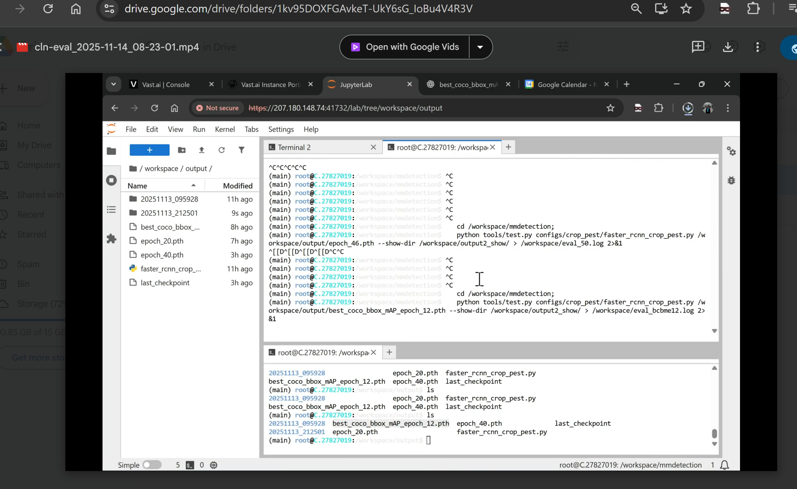
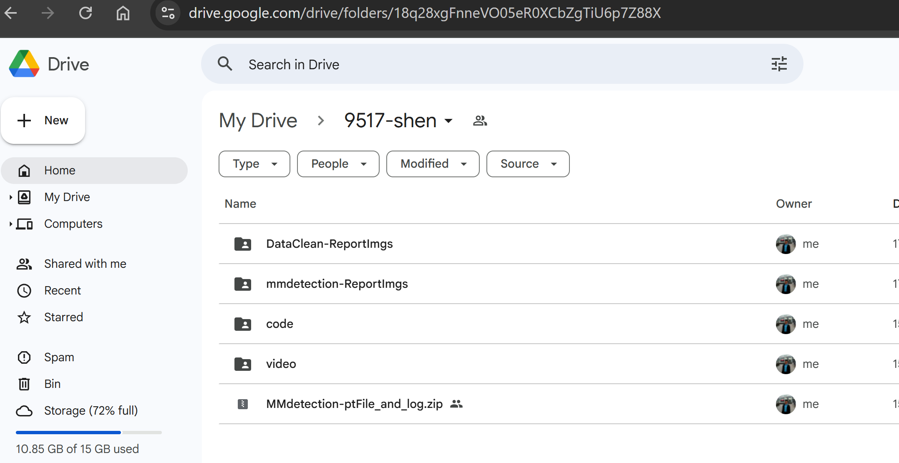

# COMP9517 Yanjian Shen statement

Hi I am the author of the changed `mmdetection` (**mmdetection original Git repo**: `https://github.com/open-mmlab/mmdetection`). When I ran **mmdetection**, I found it doesn't update since two years ago, and the code doesn't support the **python & cuda** newest security, saefty and features, hence there are some chanllenges in the compatibility with **mmdetection** and common CUDA platforms. Hence what I could do is to fork the repo and then I did a lot of changes inside its many internal files, hence that's why I can run it successfully.

For the co-operation of our **25T3 COMP9517 Group44-AlphaVison**, for my part more theoritical understanding work, you can refer to the doc below (Not much revelent with the code).

Google Doc: `https://docs.google.com/document/d/1H8y2cItitBfidH8BwDBNAL4e1RJpIFDKc4HgqvQaMic/edit?tab=t.9ud2au53lm5g`

For my running video demonstration:

`https://drive.google.com/drive/folders/1kv95DOXFGAvkeT-UkY6sG_IoBu4V4R3V`




And I uploaded all my part here:

https://drive.google.com/drive/folders/18q28xgFnneVO05eR0XCbZgTiU6p7Z88X




# File Structure Explanation

The data downloaded from KaggleHub is in YOLOv5 v8 format, but MMD (MMDetection) does not directly support this format.

Therefore, a script `yolo2coco.py` was written to convert the format from YOLO's `data.yaml` to three JSON files from Cocoa. The Cocoa format JSON includes file paths, but the YOLO label coordinate data is written into the JSON by Cocoa; this is the difference between YOLO and Cocoa formats.

My script directly writes the three Cocoa JSON files to the directory `/root/.cache/kagglehub/datasets/rupankarmajumdar/crop-pests-dataset/versions/2/`, omitting the `annotations` directory name wrapping.

# Environmental Preparation
   
   cd /workspace/
   git clone https://github.com/SenRanja/mmdetection.git
   chmod +x ./mmdetection/prepare.sh
   ./mmdetection/prepare.sh
   

Python should be **3.10.x**, there is something wrong if **3.11.x** or **3.12.x**.

Please run `./prepare.sh` directly. And then run sections **train** and **verification**.

# train

   cd /workspace/mmdetection;
   python tools/train.py configs/crop_pest/faster_rcnn_crop_pest.py > /workspace/train.log 2>&1

# Verification (replace the weight names yourself)

   cd /workspace/mmdetection;
   python tools/test.py configs/crop_pest/faster_rcnn_crop_pest.py /workspace/output/epoch_60.pth --show-dir /workspace/output_60_show/ > /workspace/eval_60.log 2>&1

---

# prepare.sh each step explanation (Yanjian Shen changed, you don't need to run this section reduntantly if you have run ./mmdetection/prepare.sh already)

```bash
# Install daemon process
apt install screen

cd /workspace/

# Install dependencies
pip install -U pip setuptools wheel
pip install kagglehub
pip install torch torchvision torchaudio
pip install -U openmim
mim install mmengine
mim install mmdet
git clone https://github.com/SenRanja/mmdetection.git

# Install mmcv
# This process is a bit time-consuming because I kept encountering errors during my research. Please strictly follow the bash instructions here.
cd /workspace/
pip uninstall -y mmcv mmcv-full
git clone https://github.com/open-mmlab/mmcv.git
cd mmcv
git checkout v2.1.0   # This version is most compatible with the latest version of mmdetection
MMCV_WITH_OPS=1 FORCE_CUDA=1 python setup.py build_ext --inplace
pip install -e .
python -c "import mmcv; print(mmcv.__version__); import mmcv.ops; print('✅ mmcv._ext loaded successfully')"

```

Then the manual part:

```bash
cd /workspace/
# [Do not copy here! Manual operation is required]

# Manually copy the files here

# Copy download.py and yolo2coco.py to /workspace/

# Copy faster_rcnn_crop_pest.py to /workspace/mmdetection/configs/crop_pest/

# Download the KaggleHub dataset

# Default dataset path:
# /root/.cache/kagglehub/datasets/rupankarmajumdar/crop-pests-dataset/versions/2/
python /workspace/mmdetection/download.py
```

Data cleaning

```bash
cd /workspace/
git clone https://github.com/SenRanja/Aug.git
pip install -U pip setuptools wheel
pip install albumentations kagglehub

# Replace
NEW_PATH=$(python /workspace/Aug/download.py)
sed -i "s|kagglehub_crop_pests_dataset_path = r'.*'|kagglehub_crop_pests_dataset_path = r'$NEW_PATH'|" /workspace/Aug/main.py

# Data Cleaning
cd /workspace/Aug/
python /workspace/Aug/main.py
cd /workspace/

```


```bash
# Perform yolo2coco conversion
python /workspace/mmdetection/yolo2coco.py
```

Because of the security mechanisms for deserialization in newer versions of Python, and the method used by this library itself, the function of generating image prediction, labeling, and comparison cannot be implemented. My method can be used here to run this model.

```bash
#!/bin/bash

FILE="/venv/main/lib/python3.10/site-packages/mmengine/runner/checkpoint.py"

# 备份
cp "$FILE" "$FILE.bak"

# 删除旧的函数内容（包含装饰器）
sed -i "/@CheckpointLoader.register_scheme(prefixes='')/,/return checkpoint/d" "$FILE"

# 追加新的函数（包含装饰器）
cat << 'EOF' >> "$FILE"

@CheckpointLoader.register_scheme(prefixes='')
def load_from_local(filename: str, map_location: str = 'cpu') -> dict:
    import torch
    import mmengine.logging

    filename = osp.expanduser(filename)
    if not osp.isfile(filename):
        raise FileNotFoundError(f"{filename} can not be found.")

    # 信任 mmengine 的日志对象，避免 UnpicklingError
    torch.serialization.add_safe_globals([mmengine.logging.history_buffer.HistoryBuffer])

    # 允许完整反序列化
    checkpoint = torch.load(filename, map_location=map_location, weights_only=False)

    return checkpoint

EOF

echo "✔ Replacement complete：$FILE"
```

